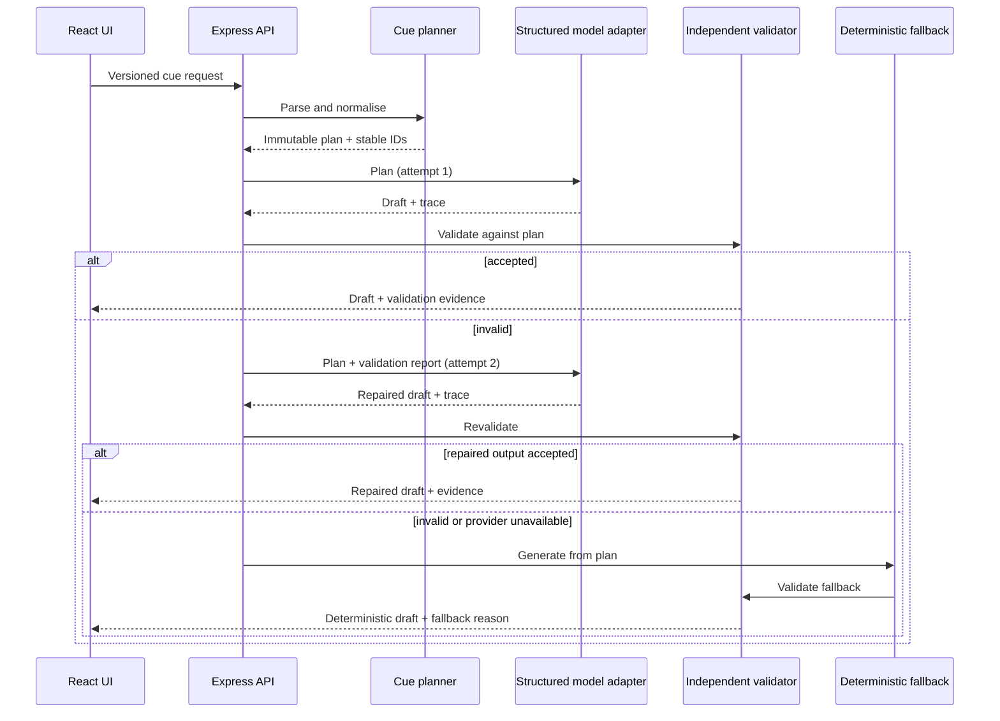

# Architecture and failure model

## Processing sequence

## Trust boundaries

The browser is untrusted. Catalogue membership, cardinality, text lengths, and completeness are checked again by the server-side planner. The model is also untrusted: Structured Outputs establishes shape, while `outputValidator.js` independently checks semantic invariants against the immutable plan. Only an accepted output or the accepted deterministic fallback is returned.

The OpenAI API key is loaded by `server/index.js` from `.env.local`; no `VITE_` variable contains it. Client bundles can therefore be inspected without revealing the credential.

## Failure classes and decisions

| Failure | Detection | Bounded response | Observable result |
|---|---|---|---|
| Malformed/tampered input | Zod + catalogue checks | Reject before provider call | HTTP 400 |
| Missing cue ID/text | Independent validator | One repair attempt | `model-repair` or fallback |
| Invented trace ID | Set-difference check | One repair attempt | `model-repair` or fallback |
| Missing support/style constraint | ID and literal-text check | One repair attempt | `model-repair` or fallback |
| Parser/provider transient error | SDK exception | Retry once | model result or fallback |
| Invalid key, no credit, denied model | status/error classification | Do not retry | provider-unavailable fallback |
| Persistent invalid output | Second validation failure | Deterministic generation | validation-backed fallback |

The deterministic generator is intentionally independent of the model adapter. If it ever fails the same validator, the server raises an invariant error instead of silently returning unchecked text.
